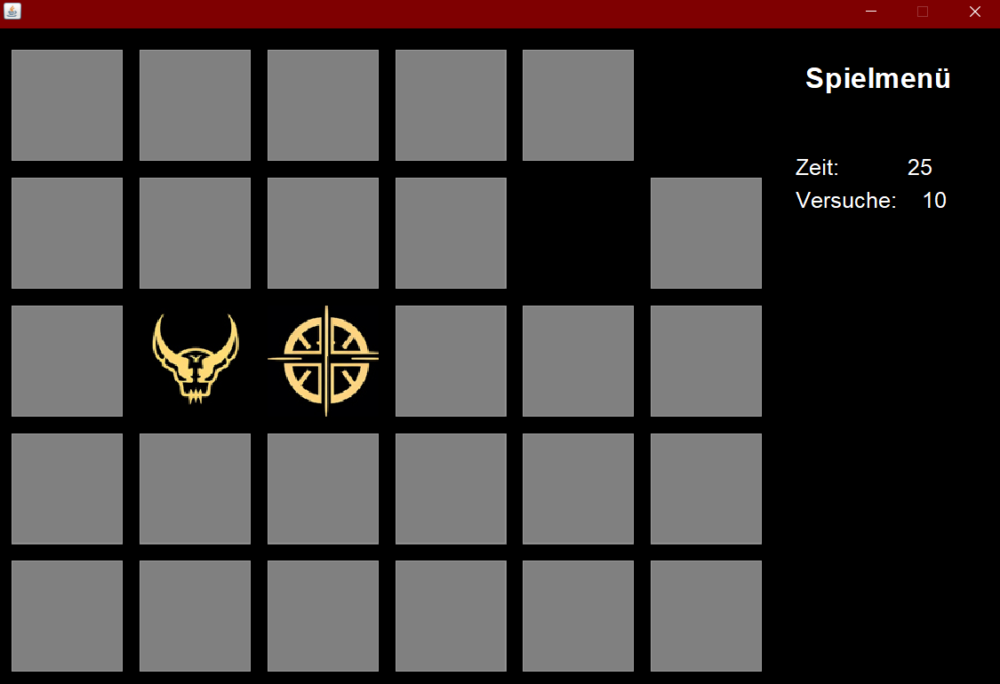

# Java-Memory 🎮 

Ein einfaches, erweiterungsfähiges Memory-Spiel in Java.

## Beschreibung

Java-Memory ist ein klassisches Memory-Spiel, das in Java implementiert ist. Ziel des Spiels ist es, alle Kartenpaare zu finden und aufzudecken. Das Spiel ist modular aufgebaut und ermöglicht es, neue Motive hinzuzufügen.

## Funktionen

- 🎮 Klassisches Memory-Spielprinzip
- 🖼️ Erweiterbare Motivsammlung
- 🎯 Einfache und intuitive Bedienung 
- 🔧 Modularer Code für einfache Erweiterungen
- 🎴 Beliebige Spielfeldgröße (Variable Felder in Memory.java)

## Anforderungen

- Java 8 oder höher

## Installation & Ausführung

## 1. Repository klonen:
```bash
git clone https://github.com/Be7zy/Java-Memory.git
cd Java-Memory
```

## 2. Projekt öffnen:
- Öffne das Projekt in deiner bevorzugten IDE (z.B. IntelliJ IDEA, Eclipse oder NetBeans)
- Stelle sicher, dass Java 8 oder höher installiert ist

## 3. Projekt kompilieren:
```bash
javac -d bin src/*.java
```

## 4. Spiel starten:
```bash
java -cp bin Main
```
oder .jar Datei auführen ( derOrder Icons 
                          muss im selben Ordner wie die .jar sein)

## 5. Motive hinzufügen:
- Speichere deine Bilder im `bin/Icons/` Verzeichnis
- Die unterstützten Formate sind: PNG, JPG (128*128px)

## Features:
- 🎮 Einfaches Memory-Spiel
- 🎯 Beliebige Spielfeldgröße (Variable Felder in Memory.java)



## Lizenz:
Dieses Projekt steht unter der MIT Lizenz
